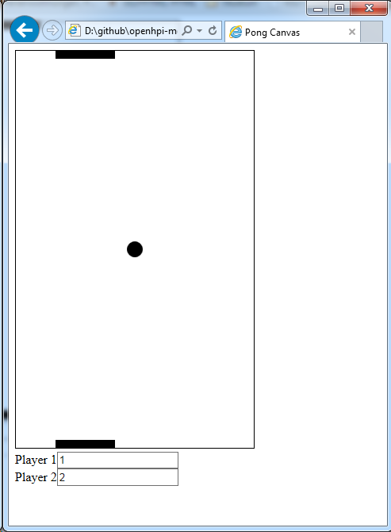

# CSS Peer Assessment Exercise

On this place you can find my solution for the online course [Web Technologies by Prof. Dr. Christoph Meinel](https://open.hpi.de/courses/webtech2015) 

## CSS Peer Assessment Exercise.

**Filename:** 1.html

**Task:** build a website using html and css

----

## Pong Weekly Assignment.

**Filename:** pong_canvas_OO_task.hmtl

**Task:**
- Remove the upper wall
- Add a second player with a paddle that can be controlled via two different keys ("A" and "D') on the same keyboard.
- Get the counter working. It should count the points of each player. Player 1 gets a point whenever the ball passes player 2 and is out/reset to the start position.

